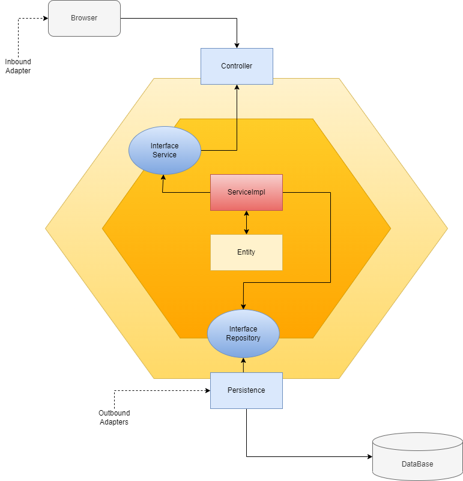

# CRM - Arquitectura Hexagonal

## Obejtivo

Desarrollar un CRM bajo la arquitectura hexagonal o tambien conocida como puertos y adaptadores

## Qué es la arquitetura hexagonal?
### Definición
La Arquitectura Hexagonal, dada a conocer por Alistair Cockburn — y también conocida como arquitectura de puertos y adaptadores — , tiene como principal motivación separar nuestra aplicación en distintas capas o regiones con su propia responsabilidad. De esta manera consigue desacoplar capas de nuestra aplicación permitiendo que evolucionen de manera aislada. Además, tener el sistema separado por responsabilidades nos facilitará la reutilización.

Esta arquitectura se suele representar con forma de hexágono, pero el número de lados no es lo que importa, sino lo que estos representan. Cada lado representa un puerto hacia dentro o fuera de la aplicación

La Arquitectura Hexagonal propone que nuestro dominio sea el núcleo de las capas y que este no se acople a nada externo. En lugar de hacer uso explícito y mediante el principio de inversión de dependencias nos acoplamos a contratos (interfaces o puertos) y no a implementaciones concretas.

Esto es lo llamado puertos y adaptadores, que podrían ser definidos de la siguiente manera:
Puerto: definición de una interfaz pública.
Adapter: especialización de un puerto para un contexto concreto.

## Ejemplos de componentes que que forman parte de la arquitectura hexagonal
## Adaptadores
### primarios (entrada)
* Controladores
* Colas de mesages (Rabbit, Kafka.... etc) - Consumidores
* APIs Externas
* Servicios de correo
### secundarios (salida)
* Repositorios (Base de datos)
* Colas de mensages (Rabbit, Kafka.... etc) - Publicadores

## Puertos
* Interfaces (Servicios)

## Casos de uso
* implementaciones de servicios
## Entidades
* Modelos de datos (Tabla de bases de datos)

## Configuraciones
## Dominio
* modelo
* puertos
* casos de uso

## Arquitectura hexagonal actual del CRM

En la figura se puede observar como esta estructurado el CRM de acurdo a la arquitetura hexagonal, todo con la finalidad de evitar el acoplamiento entre capas. En la parte interna se puede observar todos los casos de uso (ServiceImpl) y las entidades que forman parte del dominio y en la parte exterior se observa UI y la base de datos, la comunicación entre la parte interna y externa se lo realiza mediante los adaptadores y puertos.
## Acerca del proyecto
El CRM o tambien conocido por sus siglas en ingles como Customer Relationship Management (Gestión de la Relación con el Cliente).
El CRM permite el almacenamiento de información de clientes actuales y potenciales, en donde se reúne e integra datos valisos para preparar y actualizar a tus equipos con información personal de los clientes, historial y preferencias de compras.

El proyecto consiste en un CRM que simula un concesionario de vehiculos, en donde se realiza un constante registro de clientes que van a relizar la compra de vehiculos así como también clientes potenciales que muestran interés en ciertos vehiculos.

## Funcionalidades del CRM

* Gestión de Usuarios.
* Gestion de Clientes.
* Gestón de Vehiculos.
* Queda abierto a nuevas funcionalidades.....

Mediante el CRM  los usuarios con rol de Ventas son los encargados de la administración  de  clientes actuales y potenciales que son registrados en el CRM. Cada usuario gestiona sus respectivos clientes, un cliente no puede estar asociado a dos usuarios del CRM. 
Los clientes pueden mostrar interes por varios vehículos, los mismos que son registrados en el CRM, y el usuario es el encargado de registrar el numero de vehiculos en los cuales esta interesado un cliente y llevar su seguimiento hasta la compra del vehiculo.

## Entorno de desarrollo del CRM
El crm ha sido desdarrollado con la siguientes tecnologías

### Lenguaje de programación:
* Java
* JDK 11
* Framework Spring Boot 2.0

### Object-Relational mapping
* Hibernate
### Base de datos
* PostgeSQL

